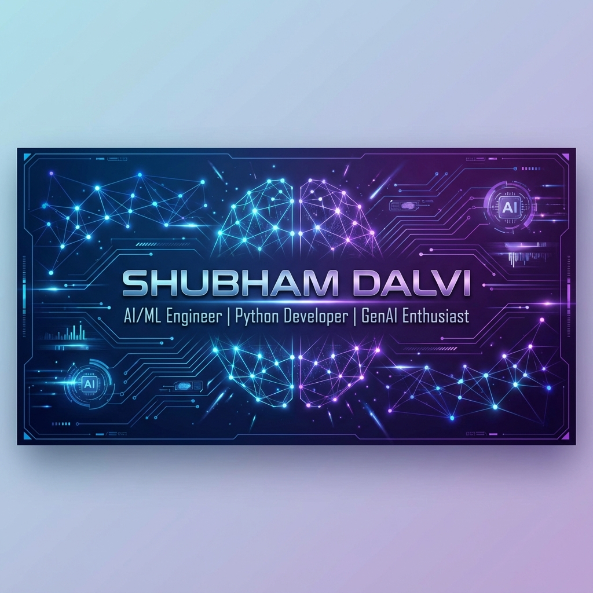
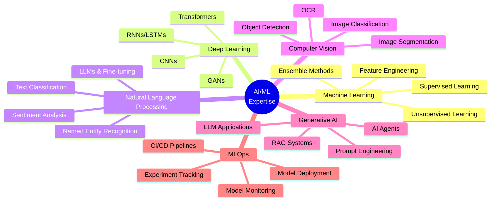

<div align="center">
  
</div>

<h1 align="center">
  
</h1>

<p align="center">
  <a href="https://www.linkedin.com/in/shubhamdalvi1911/"></a>
  <a href="mailto:shubhamdalvi1911@gmail.com"></a>
  
</p>

---

## 👨‍💻 About Me

```python
class ShubhamDalvi:
    def __init__(self):
        self.name = "Shubham Dalvi"
        self.role = "AI/ML Engineer"
        self.location = "India"
        self.domains = ["Artificial Intelligence", "Machine Learning", 
                       "Deep Learning", "Generative AI"]
        self.languages = ["Python", "SQL"]
        self.current_focus = ["LLMs", "Computer Vision", "NLP", "MLOps"]
        
    def say_hi(self):
        print("Thanks for visiting! Let's build something amazing together!")

me = ShubhamDalvi()
me.say_hi()
```

🔭 **Currently Working On:** Building innovative AI/ML solutions and exploring cutting-edge GenAI applications  
🌱 **Currently Learning:** Advanced LLM architectures, RAG systems, and MLOps best practices  
💡 **Passionate About:** Transforming complex data into actionable insights using AI/ML  
🤝 **Open to Collaborate:** AI/ML projects, Research papers, Open-source contributions  
💬 **Ask Me About:** Python, Machine Learning, Deep Learning, NLP, Computer Vision, GenAI  

---

## 🛠️ Tech Stack

### **Languages**
<p>
  
  
  
</p>

### **AI/ML Frameworks & Libraries**
<p>
  
  
  
  
  
  
  
</p>

### **Data Science & Analytics**
<p>
  
  
  
  
  
</p>

### **MLOps & Deployment**
<p>
  
  
  
  
</p>

### **Cloud & Databases**
<p>
  
  
  
  
</p>

### **Tools & Platforms**
<p>
  
  
  
  
</p>

---

## 📊 GitHub Statistics

<div align="center">
  
  
</div>

<div align="center">
  
  
</div>

---

## 🎯 Areas of Expertise



---

## 🏆 GitHub Trophies

<div align="center">
  
</div>

---

## � Contribution Activity

<div align="center">
  
</div>

---

## 🤝 Let's Connect!

<p align="center">
  I'm always excited to collaborate on innovative AI/ML projects, discuss cutting-edge technologies, or just have a chat about the future of AI!
</p>

<p align="center">
  <a href="https://www.linkedin.com/in/shubhamdalvi1911/">
    
  </a>
  <a href="mailto:shubhamdalvi1911@gmail.com">
    
  </a>
</p>

---

<div align="center">
  
</div>

<div align="center">
  
</div>

---

<p align="center">
  <i>⭐️ From <a href="https://github.com/ShubhamDalvi1911">ShubhamDalvi1911</a> - Feel free to star my repositories if you find them interesting!</i>
</p>
